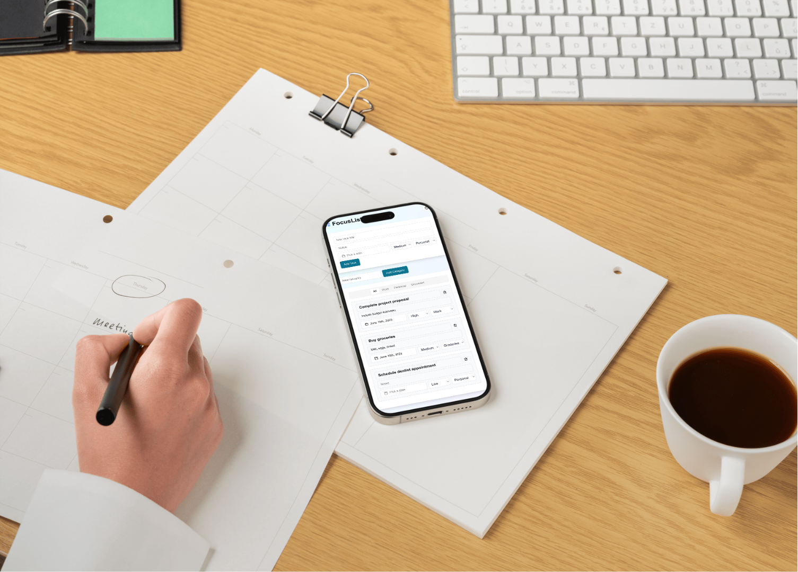

# To-Do List App



This is a [Next.js](https://nextjs.org) project bootstrapped with [`create-next-app`](https://nextjs.org/docs/app/api-reference/cli/create-next-app). This implementation provides a basic to-do list app with the following features:

## Features

### Task Management

1. Users can create new tasks with a title, notes, due date, priority, and list category.
2. Tasks can be edited inline.
3. Tasks can be deleted.

### Lists and Organization

1. Tasks are grouped into predefined lists (Work, Personal, Groceries).
2. A tab interface allows users to view all tasks or filter by list.

### User Interface

1. The design is clean and minimalist, with components from Shadcn.
2. It uses a card-based layout for tasks and a tab interface for list filtering.

### Task Properties

1. Each task has a title, notes, due date, priority, and list category.
2. Due dates can be set using a calendar popup.


## Getting Started

First, run the development server:

```bash
npm run dev
# or
yarn dev
# or
pnpm dev
# or
bun dev
```

Open [http://localhost:3000](http://localhost:3000) with your browser to see the result.

You can start editing the page by modifying `app/page.tsx`. The page auto-updates as you edit the file.

This project uses [`next/font`](https://nextjs.org/docs/app/building-your-application/optimizing/fonts) to automatically optimize and load [Geist](https://vercel.com/font), a new font family for Vercel.

## Learn More

To learn more about Next.js, take a look at the following resources:

- [Next.js Documentation](https://nextjs.org/docs) - learn about Next.js features and API.
- [Learn Next.js](https://nextjs.org/learn) - an interactive Next.js tutorial.

You can check out [the Next.js GitHub repository](https://github.com/vercel/next.js) - your feedback and contributions are welcome!

## Deploy on Vercel

The easiest way to deploy your Next.js app is to use the [Vercel Platform](https://vercel.com/new?utm_medium=default-template&filter=next.js&utm_source=create-next-app&utm_campaign=create-next-app-readme) from the creators of Next.js.

Check out our [Next.js deployment documentation](https://nextjs.org/docs/app/building-your-application/deploying) for more details.
